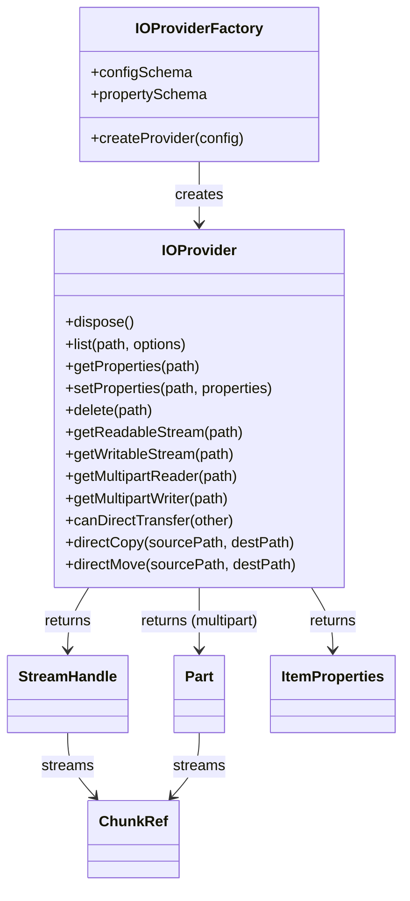

# pluggable-io-framework-api

[](https://github.com/flowscripter/pluggable-io-framework-api/releases)
[](https://github.com/flowscripter/pluggable-io-framework-api/actions/workflows/release-bun-library.yml)
[](https://flowscripter.github.io/pluggable-io-framework-api/index.html)
[](https://github.com/flowscripter/pluggable-io-framework-api/blob/main/LICENSE)

> API contracts for [pluggable-io-framework](https://github.com/flowscripter/pluggable-io-framework)
> source/sink provider plugins

## Key Features

- Defines the `IOProviderFactory`/`IOProvider` contract that source/sink
  plugins (e.g. local filesystem, object storage) implement, discovered and
  loaded via
  [dynamic-plugin-framework](https://github.com/flowscripter/dynamic-plugin-framework).
- Config and per-item property schemas are defined with
  [Zod](https://zod.dev) (source of truth), portable to JSON Schema via
  `zod-to-json-schema` for hand-edited config files or non-TS validation.
- `ChunkRef`: a tagged-union stream payload (`js` vs `native`) that carries
  memory ownership/origin with it, enabling zero-copy handoff to/from
  Rust-FFI-backed providers and decorators, with a small adapter to the
  standard Web Streams `ReadableStream<Uint8Array>`/`WritableStream<Uint8Array>`
  for interop (`fetch`, `pipeTo`, etc.).
- Well-known item properties (`size`, `lastModified`, `isFolder`,
  `contentType`) guaranteed by every provider, plus a provider-specific
  `properties` extension bag for anything else (etag, storage class, custom
  tags).
- Multipart transfer modeled as a stream of independently readable/writable
  `Part` handles, so parts can be processed concurrently.
- Telemetry as a global `TelemetryHooks` object supplied once at
  initialisation; every operation reports through it tagged with a
  correlation id.
- Pure TypeScript, minimal dependencies, no concrete provider
  implementations - see
  [pluggable-io-framework](https://github.com/flowscripter/pluggable-io-framework)
  for orchestration and
  [pluggable-io-framework-plugin-filesystem](https://github.com/flowscripter/pluggable-io-framework-plugin-filesystem)
  for a reference implementation.

## Bun Module Usage

Add the module:

`bun add @flowscripter/pluggable-io-framework-api`

Implement a provider factory:

```typescript
import { z } from "zod";
import type { IOProviderFactory } from "@flowscripter/pluggable-io-framework-api";

const configSchema = z.object({ rootPath: z.string() });
const propertySchema = z.object({ etag: z.string().optional() });

const factory: IOProviderFactory<z.infer<typeof configSchema>> = {
  configSchema,
  propertySchema,
  async createProvider(config) {
    // return an IOProvider implementation
  },
};
```

## Development

Install dependencies:

`bun install`

Build (produces `dist/` for Node.js and TypeScript consumers; Bun uses raw source directly):

`bun run build`

Test:

`bun test`

Format:

`bunx oxfmt`

Lint:

`bunx oxlint index.ts src/ tests/`

Generate HTML API Documentation:

`bunx typedoc index.ts`

## Documentation

### Overview



### API

Link to auto-generated API docs:

[API Documentation](https://flowscripter.github.io/pluggable-io-framework-api/index.html)

## License

MIT © Flowscripter
