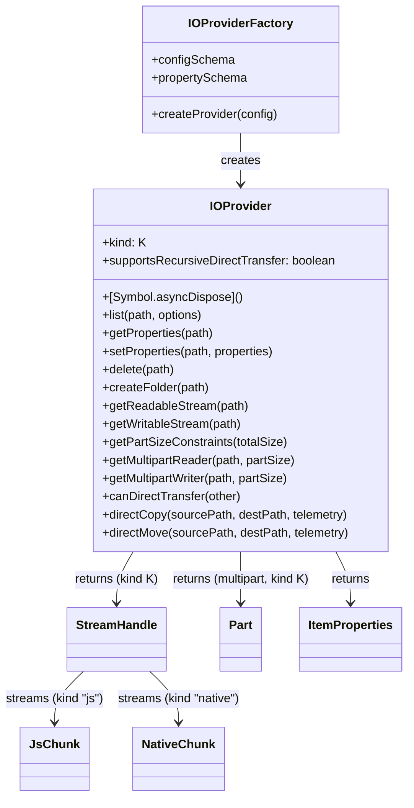

# pluggable-io-framework-api

> API for the https://github.com/flowscripter/pluggable-io-framework

## Key Features

- Defines the `IOProviderFactory`/`IOProvider` contract that source/sink
  plugins (e.g. local filesystem, object storage) implement which are then discovered and
  loaded via
  [dynamic-plugin-framework](https://github.com/flowscripter/dynamic-plugin-framework).
- `IOProvider`, `StreamHandle` and `Part` are tagged with the single
  `ChunkKind` ("js" or "native") a provider natively produces/consumes -
  streams are homogeneous, so consumers never test each chunk's kind. A
  mismatch between two linked streams is decided once per link via
  `adaptReadableStream`, not once per chunk.
- `JsChunk`/`NativeChunk`: a tagged-union stream payload that carries memory
  ownership/origin with it, enabling zero-copy handoff to/from
  Rust-FFI-backed providers and decorators, with a small adapter to the
  standard Web Streams `ReadableStream<Uint8Array>`/`WritableStream<Uint8Array>`
  for interop (`fetch`, `pipeTo`, etc.).
- Capabilities beyond plain streaming (e.g. `seekable`) are modeled as
  small interfaces (`Seekable`, `RangeReadable`) with co-located type guards
  (`isSeekable`, `isRangeReadable`).
- Well-known item properties (`size`, `lastModified`, `isFolder`,
  `contentType`) are default for every provider.
- A provider-specific
  `properties` extension bag supports other properties (e.g. etag, storage class, custom tags).
- Provider config and per-item property schemas are defined with
  [Zod](https://zod.dev).
- Multipart transfers are modeled as a stream of independently readable/writable
  `Part` handles allowing parts to be processed concurrently. A provider
  optionally reports `PartSizeConstraints` (min/max/default part size, max
  part count) for a given file size via `getPartSizeConstraints` so a caller
  (e.g. [pluggable-io-framework](https://github.com/flowscripter/pluggable-io-framework)'s
  `copy`/`move`) can negotiate a single part size that satisfies both a
  source and a sink (e.g. S3's minimum part size and 10000-part cap).
- `createFolder` is an optional capability for recreating empty folders at a
  destination; `supportsRecursiveDirectTransfer` lets a provider declare that
  its `directCopy`/`directMove` accept a folder path and recurse internally.
- A global `TelemetryHooks` object is supplied once at
  initialisation and every operation reports through it tagged with a
  correlation ID. Child operations (multipart parts, recursive-copy entries)
  report their own progress tagged with a `parentOperationId` alongside the
  parent's own aggregate stream. `directCopy`/`directMove` accept an optional
  `TransferTelemetry` (`operationId` + `TelemetryHooks`) so a provider with
  native progress reporting can surface it.
- `TransientIOError`/`PermanentIOError` are a small error taxonomy providers
  can throw/wrap their backend errors in, so framework-level retry logic can
  classify a failure as worth retrying without knowing about any specific
  backend's error shapes.
- Disposal is `Symbol.asyncDispose` (TC39 explicit resource management) -
  `await using provider = await factory.createProvider(config)` disposes
  deterministically, including on thrown errors.
- See
  [pluggable-io-framework](https://github.com/flowscripter/pluggable-io-framework)
  for orchestration and
  [io-plugin-filesystem](https://github.com/flowscripter/io-plugin-filesystem)
  for a reference implementation.

## Development

Install dependencies:

`bun install`

Build (produces `dist/` for Node.js and TypeScript consumers; Bun uses raw source directly):

`bun run build`

Test:

`bun test`

Format:

`bunx oxfmt`

Lint:

`bunx oxlint index.ts src/ tests/`

Generate HTML API Documentation:

`bunx typedoc index.ts`

## Documentation

### Overview

### API

Link to auto-generated API docs:

[API Documentation](https://flowscripter.github.io/pluggable-io-framework-api/index.html)

## License

MIT © Flowscripter
