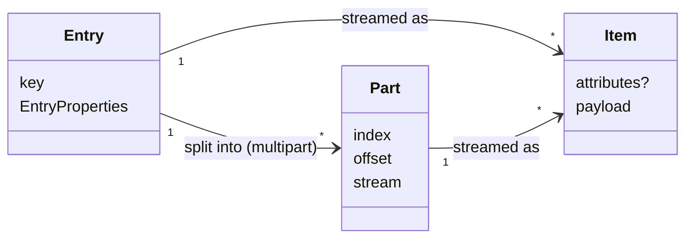

# pluggable-io-framework-api

[](https://github.com/flowscripter/pluggable-io-framework-api/releases)
[](https://github.com/flowscripter/pluggable-io-framework-api/actions/workflows/release-bun-library.yml)
[](https://flowscripter.github.io/pluggable-io-framework-api/index.html)
[](https://github.com/flowscripter/pluggable-io-framework-api/blob/main/LICENSE)

> API for the [pluggable-io-framework](https://github.com/flowscripter/pluggable-io-framework)

## Usage

Provider plugin authors should depend on this package (not the full
`@flowscripter/pluggable-io-framework`) as a `peerDependency`:

```jsonc
{
  "peerDependencies": {
    "@flowscripter/pluggable-io-framework-api": "*",
  },
}
```

A plugin registers an `IOProviderFactory` (and optionally
`PayloadConverter`s) via
[dynamic-plugin-framework](https://github.com/flowscripter/dynamic-plugin-framework)
using the exported extension point constants.

Key exports:

- `IOProviderFactory` - declares a provider's `protocol`, `PayloadKind`, location/config/property
  Zod schemas, and turns a location into provider config plus a `LocationTarget`.
- `IOProvider` - a configured source/sink: streams, properties, listing and optional multipart,
  direct-transfer and resume support.
- `Item`, `JsPayload`, `NativePayload`, `PayloadKind` - the stream unit and its payload kinds.
- `StreamHandle` plus capability interfaces and guards (`RangeReadable`, `Seekable`,
  `BufferProvider`, `FillReadable`, `ResumableWritable`, ...).
- `ProviderContext`/`ProviderResolver`, `PayloadConverter`, `TelemetryHooks`,
  `TransientIOError`/`PermanentIOError`.

## Location Strings and Location Objects

An `IOProviderFactory` accepts a location in two forms, and both end at its
`locationSchema`:

- A location string (`file:///data/a.txt`, `s3://bucket/key`), converted by
  the factory's required `parseLocationString` into a raw location object.
  It carries only what the protocol's URL form can express. It is the form
  `ProviderResolver.createProviderForLocation` takes, because a composite
  provider resolves URLs it discovers at runtime.
- A raw location object, validated by `locationSchema` directly. It can
  carry every field the schema defines, including those a string cannot:
  a `filename` or glob `pattern`, connection settings and credentials
  (marked `.meta({ secret: true })`).

Hosts such as `pluggable-io-framework`'s `ProviderRegistry` accept both
forms.

## Entries, Items and Parts

- An **entry** is a single stored thing a provider addresses by key: a file,
  an object, an HTTP resource. Its metadata is `EntryProperties`. Entries
  live in **containers** (directories, prefixes), and a `LocationTarget`
  names an entry, a container or a pattern of entries.
- An **item** is the unit a stream carries: optional attributes plus a
  payload (`JsPayload` or `NativePayload`). Reading an entry through a
  `StreamHandle` yields a sequence of items; writing items to a writable
  `StreamHandle` produces an entry. One entry is usually many items.
- A **part** is one byte range of an entry in a multipart transfer: an
  `index`, an `offset` and its own stream of items. An entry is split into
  parts so they can be transferred concurrently and reassembled by the
  sink's multipart writer.


```mermaid
classDiagram
    direction LR
    class Entry {
      key
      EntryProperties
    }
    class Part {
      index
      offset
      stream
    }
    class Item {
      attributes?
      payload
    }
    Entry "1" --> "*" Part : split into (multipart)
    Entry "1" --> "*" Item : streamed as
    Part "1" --> "*" Item : streamed as
```

See [pluggable-io-framework](https://github.com/flowscripter/pluggable-io-framework)
for full documentation.

## Development

Install dependencies:

`bun install`

Build (produces `dist/` for Node.js and TypeScript consumers; Bun uses raw source directly):

`bun run build`

Test:

`bun test`

Format:

`bunx oxfmt`

Lint:

`bunx oxlint index.ts src/ tests/`

Generate HTML API documentation:

`bunx typedoc index.ts`

### API

Auto-generated API docs:

[API Documentation](https://flowscripter.github.io/pluggable-io-framework-api/index.html)

## License

MIT © Flowscripter
