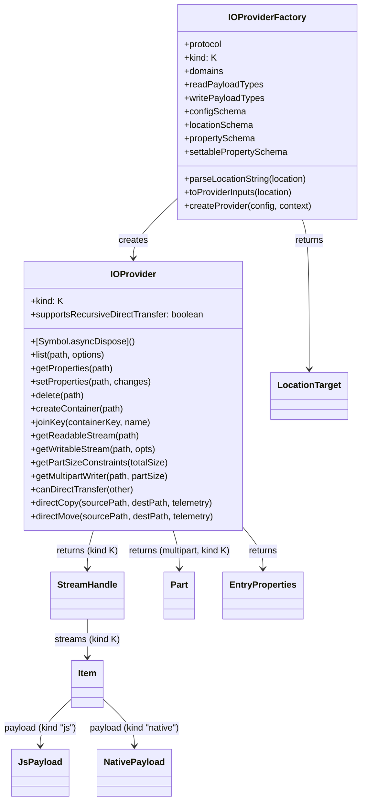

# pluggable-io-framework-api

> API for the https://github.com/flowscripter/pluggable-io-framework

## Key Features

- Defines the `IOProviderFactory`/`IOProvider` contract that source/sink
  plugins (e.g. local filesystem, object storage) implement which are then discovered and
  loaded via
  [dynamic-plugin-framework](https://github.com/flowscripter/dynamic-plugin-framework).
- Each `IOProviderFactory` declares the `protocol` it serves (e.g. `file`,
  `s3`, `https`) and the `PayloadKind` of the providers it creates, so a
  registry can select a factory by (protocol, kind) before instantiating
  anything. Native factories also declare their memory `domains`, and every
  factory may declare the payload type IDs it reads/writes
  (`readPayloadTypes`/`writePayloadTypes`, default `["bytes"]`).
- Locations are self-contained: a factory's `locationSchema` (Zod) describes
  every field a location can carry (connection info, `path`/`filename`/
  `pattern`, credentials marked with `.meta({ secret: true })`).
  `parseLocationString` turns a location string into a raw location object,
  and `toProviderInputs` splits a validated location into the provider config
  and an explicit `LocationTarget` (`entry` | `container` | `pattern`).
- `createProvider(config, context)` receives a `ProviderContext` with the
  negotiated memory domain and a `ProviderResolver`, so a composite provider
  can obtain other installed providers instead of bundling its own clients.
- Stream payloads are `Item`s (optional `attributes` plus a `JsPayload` or
  `NativePayload`), aligned with the flowscripter domain model. Streams are
  homogeneous in `PayloadKind` ("js" or "native"), so consumers never test
  each item's kind. A mismatch between two linked streams is decided once
  per link via `adaptReadableStream`, not once per item.
- `NativePayload` carries memory ownership (`release()`) and a memory
  `domain` (`"host"` by default), enabling zero-copy handoff to/from
  Rust-FFI-backed providers. Payload converters between kinds/domains are
  plugins (`PayloadConverterExtension`) discovered via their own extension
  point. A small adapter to the standard Web Streams
  `ReadableStream<Uint8Array>` supports interop (`fetch`, `pipeTo`, etc.).
- `StreamHandle` declares whether a stream is `bounded` (default `true`;
  `false` = a live source) and its `payloadType` (default `"bytes"`).
- Capabilities beyond plain streaming are modeled as small interfaces with
  co-located type guards: `Seekable`, `RangeReadable`, `Skippable`
  (placeholder), and the native-only lease capabilities `BufferProvider` and
  `FillReadable` that let a sink hand out its own buffers for zero-copy
  writes. `StreamDecorator` wraps a handle; `StreamOpenerDecorator` wraps the
  function that opens one.
- Writes can be resumed: a writable handle implementing `ResumableWritable`
  produces a serializable `ResumeToken`, which `getWritableStream(path,
{ resume })` accepts, reporting the real `startOffset`.
- Well-known entry properties (`size`, `lastModified`, `isContainer`,
  `contentType`) are default for every provider.
- A provider-specific
  `properties` extension bag supports other properties (e.g. etag, storage class, custom tags).
  `setProperties` accepts `lastModified`/`contentType` plus a `properties`
  bag validated against the factory's `settablePropertySchema`.
- Provider config, location and per-entry property schemas are defined with
  [Zod](https://zod.dev).
- Multipart writes are modeled as a stream of independently writable
  `Part` handles allowing parts to be processed concurrently. Multipart reads
  need no provider support beyond `RangeReadable`. A provider
  optionally reports `PartSizeConstraints` (min/max/default part size, max
  part count) for a given entry size via `getPartSizeConstraints` so a caller
  (e.g. [pluggable-io-framework](https://github.com/flowscripter/pluggable-io-framework)'s
  `copy`/`move`) can negotiate a single part size that satisfies both a
  source and a sink (e.g. S3's minimum part size and 10000-part cap).
- `list`, `delete`, `setProperties`, `createContainer`, `joinKey` and
  `getMultipartWriter` are optional, so protocols without a container concept
  (e.g. http) can omit them. `supportsRecursiveDirectTransfer` lets a
  provider declare that its `directCopy`/`directMove` accept a container path
  and recurse internally.
- A global `TelemetryHooks` object is supplied once at
  initialisation and every operation reports through it tagged with a
  correlation ID. Child operations (multipart parts, recursive-copy entries)
  report their own progress tagged with a `parentOperationId` alongside the
  parent's own aggregate stream. `onGap` reports a reconnected live source. `directCopy`/`directMove` accept an optional
  `TransferTelemetry` (`operationId` + `TelemetryHooks`) so a provider with
  native progress reporting can surface it.
- `TransientIOError`/`PermanentIOError` are a small error taxonomy providers
  can throw/wrap their backend errors in, so framework-level retry logic can
  classify a failure as worth retrying without knowing about any specific
  backend's error shapes.
- Disposal is `Symbol.asyncDispose` (TC39 explicit resource management) -
  `await using provider = await factory.createProvider(config, context)` disposes
  deterministically, including on thrown errors.
- See
  [pluggable-io-framework](https://github.com/flowscripter/pluggable-io-framework)
  for orchestration and
  [io-plugin-filesystem](https://github.com/flowscripter/io-plugin-filesystem)
  for a reference implementation.

## Development

Install dependencies:

`bun install`

Build (produces `dist/` for Node.js and TypeScript consumers; Bun uses raw source directly):

`bun run build`

Test:

`bun test`

Format:

`bunx oxfmt`

Lint:

`bunx oxlint index.ts src/ tests/`

Generate HTML API Documentation:

`bunx typedoc index.ts`

## Documentation

### Overview

```mermaid
classDiagram
    IOProviderFactory --> IOProvider : creates
    IOProviderFactory --> LocationTarget : returns
    IOProvider --> StreamHandle : returns (kind K)
    IOProvider --> Part : returns (multipart, kind K)
    StreamHandle --> Item : streams (kind K)
    Item --> JsPayload : payload (kind "js")
    Item --> NativePayload : payload (kind "native")
    IOProvider --> EntryProperties : returns

    class IOProviderFactory {
      +protocol
      +kind: K
      +domains
      +readPayloadTypes
      +writePayloadTypes
      +configSchema
      +locationSchema
      +propertySchema
      +settablePropertySchema
      +parseLocationString(location)
      +toProviderInputs(location)
      +createProvider(config, context)
    }
    class IOProvider {
      +kind: K
      +[Symbol.asyncDispose]()
      +list(path, options)
      +getProperties(path)
      +setProperties(path, changes)
      +delete(path)
      +createContainer(path)
      +joinKey(containerKey, name)
      +getReadableStream(path)
      +getWritableStream(path, opts)
      +getPartSizeConstraints(totalSize)
      +getMultipartWriter(path, partSize)
      +canDirectTransfer(other)
      +supportsRecursiveDirectTransfer: boolean
      +directCopy(sourcePath, destPath, telemetry)
      +directMove(sourcePath, destPath, telemetry)
    }
```

### API

Link to auto-generated API docs:

[API Documentation](https://flowscripter.github.io/pluggable-io-framework-api/index.html)

## License

MIT © Flowscripter
